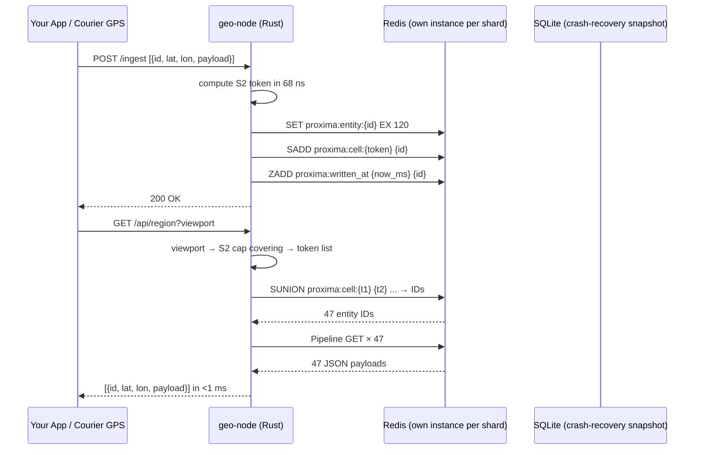
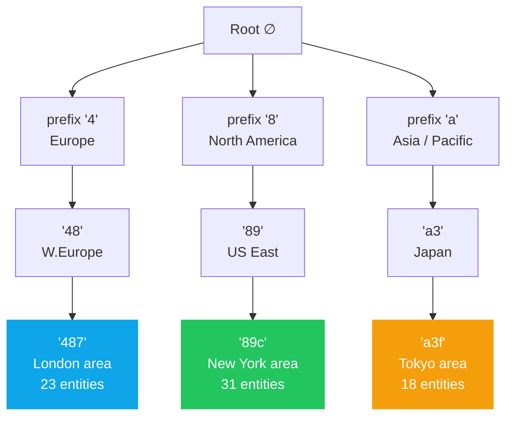
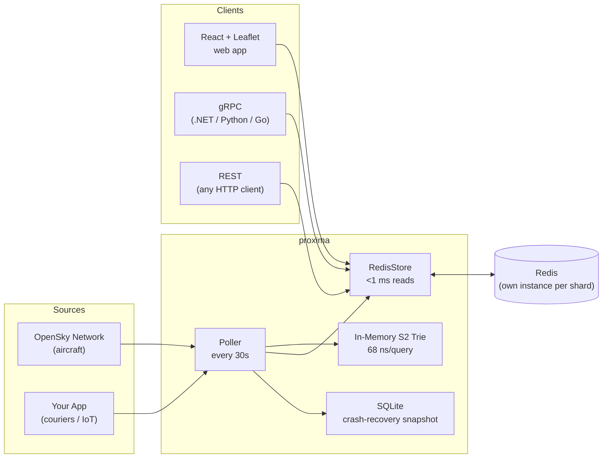
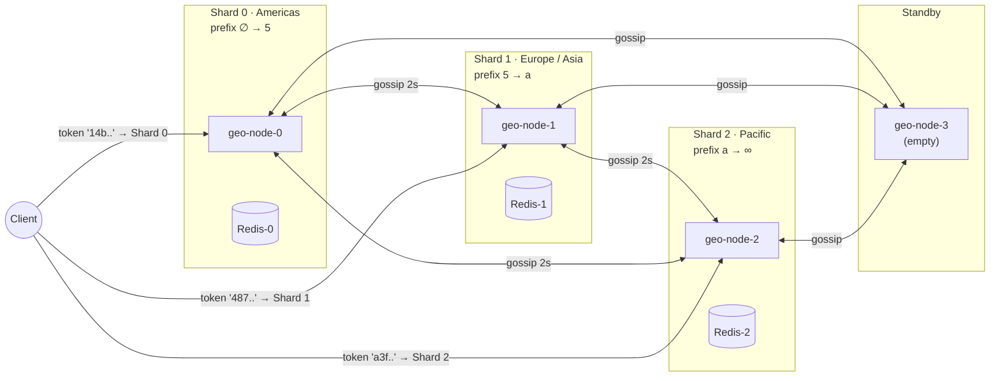

# proxima

**A distributed geospatial cache that answers "what's near me?" in under 1 ms across millions of moving objects — aircraft, couriers, IoT devices — backed by any managed Redis instance.**

Shards split automatically as load grows. No data migration overhead. No downtime. Each shard is a stateless Rust service pointed at its own Redis — run it as a Docker sidecar, a K8s pod, or against Azure Cache / ElastiCache in any region.

[](https://github.com/dsgouda7/proxima/actions/workflows/ci.yml)
[](https://crates.io/crates/proxima)
[](LICENSE)

---

## By the numbers

> All figures measured on a local Docker Redis — see [TECHNICAL.md](TECHNICAL.md) §8 for full methodology. Run yourself: `scripts/run-experiments.ps1`

| What | Measured | Notes |
|---|---|---|
| Read latency ("what's near me?") | **683 µs p50 / 933 µs p99** | 5,000 seeded entities, local Redis |
| Viewport size scaling | **+14 µs** from 1 to 32 S2 cells | S2 trie touches only relevant cells |
| Write latency (batch) | **2.95 ms p50 per 100-entity batch** | ~30 µs/entity when pipelined |
| Storage per entity | **~976 B · 3 Redis keys** | ~80 B JSON payload |
| Entities per GB of Redis | **~1 million** | Linear with payload size |
| Shard split catch-up miss | **0.5%** (192/193 writes) | `entities_written_after` completeness |
| ZSET housekeeping accuracy | **100%** stale entries pruned | `prune_written_at()` |

---



---

## Architecture

### The S2 trie

Each entity is indexed by its [Google S2](https://s2geometry.io/) cell token — a hex string where the prefix encodes geographic hierarchy. The trie organises these tokens so that *all entities near a viewport are reachable by prefix-walking a 5-level tree*, not by scanning a flat list.



A viewport query covering London computes the S2 tokens for that area (`487a`, `487b`, `487c`, ...) and issues a single `SUNION` to Redis — it never touches the New York or Tokyo subtrees.

### Redis data model

All keys live under a configurable namespace (default `proxima`). Each **shard has its own Redis instance** — keys never cross shard boundaries:

```
proxima:entity:{id}     →  SET  {json}   EX ttl    ← full entity payload
proxima:cell:{token}    →  SADD {id...}  EXPIRE ttl ← spatial index
proxima:location:{id}   →  SET  {token}  EX ttl    ← reverse lookup: id → cell token
proxima:written_at      →  ZSET score=ms member=id  ← write-timestamp index for delta sync
```

The `written_at` sorted set is the only key without a TTL — it powers `/delta-sync` during shard splits and is pruned periodically by `prune_written_at()`.

### One Redis per shard — always

```
Shard 0 (Americas)          Shard 1 (Europe)            Shard 2 (Pacific)
┌───────────────┐           ┌───────────────┐           ┌───────────────┐
│  geo-node-0   │  ←gossip→ │  geo-node-1   │  ←gossip→ │  geo-node-2   │
│  prefix [∅,5) │           │  prefix [5,a) │           │  prefix [a,∅) │
│  ┌─────────┐  │           │  ┌─────────┐  │           │  ┌─────────┐  │
│  │ redis-0 │  │           │  │ redis-1 │  │           │  │ redis-2 │  │
│  └─────────┘  │           │  └─────────┘  │           │  └─────────┘  │
└───────────────┘           └───────────────┘           └───────────────┘
```

- **Docker** (`demo/cluster-compose.yml`): each geo-node has a dedicated `redis:7-alpine` sidecar container
- **Kubernetes** (`demo/k8s/`): Redis runs as a sidecar in each shard pod — loopback latency <0.1 ms
- **Production**: set `REDIS_URL=rediss://...` per shard to a managed instance (Azure Cache for Redis, AWS ElastiCache, Redis Cloud) in the same datacenter region as the geo-node

### Data flow



---

## Quick start

### Prerequisites

| Tool | Version |
|---|---|
| [Rust](https://rustup.rs) | stable |
| [Node.js](https://nodejs.org) | ≥ 24 |
| [Docker](https://docker.com) | any recent |

### Single-node demo (aircraft tracker)

```powershell
# Windows
.\scripts\setup.ps1
.\scripts\run-demo.ps1
```

```bash
# Linux / macOS
./scripts/setup.sh && ./scripts/run-demo.sh
```

Open **http://localhost:5173** — 11,000+ live aircraft, rotating plane icons, Redis latency panel.

### Distributed cluster demo (3 shards + gossip + split)

```powershell
# Windows — starts 4 geo-node containers, walks through split + failover
.\scripts\demo-cluster.ps1

# Linux / macOS
./scripts/demo-cluster.sh
```

---

## Configuration

All values are environment variables (copy `config/.env.example` to `.env`):

| Variable | Default | Description |
|---|---|---|
| `REDIS_URL` | `redis://127.0.0.1:6379` | Local or managed Redis. Use `rediss://` for TLS. |
| `SQLITE_PATH` | `proxima.db` | Path for metadata / position-history store |
| `S2_LEVEL` | `9` | Cell granularity — 9≈70km, 12≈2km |
| `POLL_INTERVAL_SECS` | `30` | OpenSky poll cadence |
| `SPLIT_THRESHOLD_KEYS` | `500000` | Auto-split shard when key count exceeds this |
| `SPLIT_THRESHOLD_WRITE_QPS` | `50000` | Auto-split shard when write QPS exceeds this |
| `MERGE_THRESHOLD_KEYS` | `25000` | Auto-merge adjacent shards when both fall below |
| `SUSPECT_SECS` | `10` | Gossip: mark node Suspect after N silent seconds |
| `DEAD_SECS` | `30` | Gossip: mark node Dead after N silent seconds |
| `GOSSIP_INTERVAL_SECS` | `2` | How often each node gossips with peers |

### Cloud Redis

```bash
# Azure Cache for Redis (TLS)
REDIS_URL=rediss://:<access_key>@<name>.redis.cache.windows.net:6380

# AWS ElastiCache
REDIS_URL=rediss://:<auth_token>@<cluster>.cache.amazonaws.com:6380
```

---

## gRPC interface

The canonical cross-platform interface is defined in [`docs/proto/georedis.proto`](docs/proto/georedis.proto). Every `geo-node` exposes both HTTP/REST and gRPC on the same port.

```protobuf
service GeoRedis {
  rpc Insert          (GeoEntry)       returns (InsertResponse);
  rpc InsertBatch     (InsertBatchRequest) returns (InsertResponse);
  rpc QueryRegion     (RegionRequest)  returns (GeoEntriesResponse);
  rpc GetDetail       (DetailRequest)  returns (EntityDetail);
  rpc GetCluster      (Empty)          returns (ClusterResponse);
  rpc TraceCoordinate (TraceRequest)   returns (TraceResponse);
}
```

Client quickstarts:
- [.NET (C#)](docs/quickstart-dotnet.cs)
- [Python](docs/quickstart-python.py)

---

## Distributed cluster

### Geographic shard ring



### Auto-split / roll-up

The split threshold and merge threshold are configurable per cluster (see `demo/k8s/configmap.yaml`). When a shard's key count exceeds `SPLIT_THRESHOLD_KEYS`, it:

1. Scans its Redis for the median occupied S2 prefix (the geographic midpoint)
2. Provisions a standby node
3. Migrates keys ≥ split-point via HTTP batch transfer
4. Updates its own prefix range
5. Gossips the new topology to all peers

No central coordinator. No Zookeeper. Routing table convergence in O(log N) gossip rounds.

### Shard split protocol

When a shard's key count exceeds `SPLIT_THRESHOLD_KEYS`, it performs a **snapshot-first split** — a durable, crash-safe migration that does not require the source to stay live for the duration:

```
Source shard                           New shard (Standby → Bootstrapping → Active)
──────────────────────────────────────────────────────────────────────────────────────
POST /split
  ├─ mark Splitting
  ├─ Phase 1: scan entities ≥ split_point (read-only, no mutations)
  │
  ├─ Phase 2 (per chunk):
  │    POST /ingest-snapshot ─────────► 1. append to SQLite snapshot (durable)
  │                                     2. store.merge_entries() → Redis
  │    ◄──── 200 OK (both persisted) ──
  │    delete from source Redis
  │
  ├─ mark Active (new prefix range)
  │
  └─ PUT /assign-range ───────────────► set Bootstrapping
       (source_addr, snapshot_ts)        spawn bootstrap_delta_sync task:
                                           GET /delta-sync?since_ms=T ──────►
Source                                     store.merge_entries(delta)
  ├─ /delta-sync uses                       (freshness check: skip if
  │   entities_written_after()               incoming.written_at ≤ existing)
  └─ returns Vec<GeoEntry> ─────────►    set Active
                                         gossip to all peers
```

**Why snapshot-first matters:** if the new shard crashes mid-migration, it restarts and auto-restores from its SQLite snapshot — no operator intervention, no re-split. The `merge_entries` call is idempotent: re-running it after a crash writes only the entries that are still newer than what Redis holds.

**Why `Bootstrapping` state matters:** a node in `Bootstrapping` refuses all writes with 503. This prevents a split-brain scenario where the new shard accepts writes before it has finished catching up, which would create entities with stale `written_at` that the freshness check would never overwrite.

### Core library API for splits

These are the stable lib-level primitives that the demo `geo-node` builds on:

| Method | Description |
|---|---|
| `RedisStore::merge_entries(entries, s2_level)` | Additive, idempotent upsert with freshness ordering. The canonical primitive for seeding a new shard from a snapshot **and** for delta-sync catch-up. |
| `RedisStore::entities_written_after(since_ms, prefix_start, prefix_end)` | Returns all entities whose `written_at > since_ms` within a prefix range. Powers the `/delta-sync` endpoint. O(log N + result). |
| `GeoTrie::remove_range(start, end)` | Removes all entries whose S2 token falls in `[start, end)`. Called on the source shard after migration to stop holding data it no longer owns. |
| `NodeStatus::Bootstrapping` | Cluster state: node is loading snapshot + performing delta catch-up. Refuses writes until it transitions to `Active`. |

**`GeoEntry.written_at`** (Unix milliseconds, `u64`, `#[serde(default)]`) is set automatically by `persist_trie()` and `merge_entries()` when 0. It flows through snapshot serialisation and delta-sync responses unchanged, so freshness comparisons are meaningful across shard boundaries.

### Proving it's distributed

```bash
# London → must be served by the Europe shard
curl "http://localhost:4001/trace?lat=51.5&lon=-0.1"
# → { "owning_node_id": "node-1", "is_local": true, ... }

# New York → must be served by the Americas shard
curl "http://localhost:4000/trace?lat=40.7&lon=-74.0"
# → { "owning_node_id": "node-0", "is_local": true, ... }
```

### Kubernetes deployment (delivery app)

```bash
# Apply all 3 shards + gossip services
kubectl apply -k demo/k8s/

# Check ring convergence
kubectl exec -n proxima deploy/geo-node-0 -- \
  curl -s http://geo-node-0:4000/cluster | jq '.[].node_id'

# Trigger a geographic split
kubectl exec -n proxima deploy/geo-node-1 -- \
  curl -X POST http://geo-node-1:4001/split \
       -d '{"target":"geo-node-3:4003","split_point":"7"}'
```

Each pod runs **Redis as a sidecar container** — loopback latency (<0.1ms) vs cross-pod (~1ms). Replace with `REDIS_URL` pointing to Azure Cache / ElastiCache for managed HA.

---

## Benchmarks

> Controlled experiments run against a local Docker Redis. Full methodology in [TECHNICAL.md](TECHNICAL.md) §8.

| Operation | p50 | p99 | Notes |
|---|---|---|---|
| Read — 1 S2 token viewport | **683 µs** | 933 µs | 5k seeded entities |
| Read — 8 S2 token viewport | **685 µs** | 986 µs | city-scale |
| Read — 32 S2 token viewport | **697 µs** | 960 µs | country-scale |
| Write — `persist_trie` (100 entities) | **2.95 ms** | 11.63 ms | ~30 µs/entity batched |
| Trie insert (in-process) | **1.04 µs** | — | no I/O |
| Trie lookup (in-process) | **68 ns** | — | O(token_len) |

```bash
# Reproduce all 5 experiments
.\scripts\run-experiments.ps1
cargo run --release -p proxima-loadtest -- --writers 4 --readers 16 --duration-secs 60
```

---

## Why proxima vs alternatives

### tl;dr

Every other option in this space makes a write-frequency tradeoff that breaks down for real-time dynamic objects:

```
Traditional spatial DB:  optimised for complex queries on stable data
proxima:                 <1 ms reads/writes, millions of moving entities,
                         backed by any managed Redis, shards without downtime
```

### Detailed comparison

| | **proxima** | Redis GEO | PostGIS | Elasticsearch | Tile38 |
|---|---|---|---|---|---|
| **Read latency** | **<1 ms** (measured) | 10–50 ms | 5–30 ms | 10–50 ms | 5–20 ms |
| **Write latency/entity** | **~30 µs** batched | <1 ms | 5–50 ms | 200–800 ms | <1 ms |
| **Storage/entity** | **~1 KB** | ~60 B | ~200 B | ~500 B | ~200 B |
| **Entities per GB** | **~1 M** | ~16 M | ~5 M | ~2 M | ~5 M |
| **Geo sharding** | Geographic locality | Hash slot | Manual | Auto (non-geo) | None |
| **Split protocol** | Snapshot + bounded delta-sync | MIGRATE (blocking) | N/A | N/A | N/A |
| **Managed Redis** | ✓ any REDIS_URL | ✓ single-node only | N/A | N/A | N/A |
| **Hierarchical queries** | ✓ (S2 trie) | ✗ | ✓ (slow) | ✓ (slow) | ✗ |
| **Position history** | SQLite | ✗ | ✓ | ✓ | ✗ |

#### vs Redis GEO (GEOADD / GEOSEARCH)

Redis GEO uses a sorted set with geohash-encoded scores. The geohash grid has **~40% boundary distortion** — cells near the poles are much smaller than cells near the equator, and the antimeridian (±180°) creates hard splits. Neighboring cells on the earth's surface can have completely different geohash prefixes, making "nearby" queries require multiple hash prefix lookups.

S2 cells have **equal area** regardless of latitude and **no antimeridian discontinuity** — the Hilbert curve encoding means geographically adjacent cells always share a token prefix.

#### vs PostGIS

PostGIS is the gold standard for analytical queries on *static or slowly-changing* geographic data. For `UPDATE SET lat=$1, lon=$2 WHERE id=$3` happening 11,000 times every 30 seconds, PostgreSQL's MVCC creates 11,000 dead row versions that autovacuum must reclaim. The GiST spatial index needs to rebalance. You can mitigate this with `geom = ST_SetSRID(ST_Point($lon, $lat), 4326)` updates and partial indexes, but you're fighting the engine's design.

proxima replaces each entity atomically via `SET ... EX 120` — Redis's O(1) string operation.

#### vs Elasticsearch geo_point

Elasticsearch's refresh interval means **there is a 200–1000ms lag** between writing a position update and being able to search for it. For a delivery app polling every 5 seconds, this means couriers may be 1–2 polls behind. Elasticsearch also charges full document overhead per entity (~500 bytes) even for a single lat/lon pair.

#### vs Tile38

Tile38 is the closest competitor — a purpose-built real-time geo database. Key differences:

- Tile38 uses a flat R-tree; proxima uses a **trie over S2 tokens**, enabling O(token_len) prefix queries that Tile38 can't do efficiently.
- Tile38 has no distributed sharding. One server must hold all data for a geographic region with no zero-downtime scale-out path.
- Tile38 is written in Go; proxima is Rust — no GC pauses during heavy write cycles.
- Tile38 has no position history.

---

## Why Rust

1. **No GC pauses** — writing 11,000 aircraft positions every 30 seconds in a GC language (Go, Java, Python) causes stop-the-world events that spike read latency. Rust's ownership system means memory is freed deterministically at zero cost.

2. **68 ns trie lookup** — the S2 trie fits in L2 cache on a modern CPU. In Python, the same lookup would be ~5 µs due to object overhead and interpreter costs. In Rust, it's a few dozen pointer dereferences.

3. **Tokio async** — `geo-node` handles 50k QPS on a single core using non-blocking I/O. The gossip loop, HTTP server, Redis persistence, and metrics collection all run as cooperative tasks on the same thread pool.

4. **Memory efficiency** — `TrieNode` with `HashMap<u8, Box<TrieNode>>` is a cache-friendly structure. The entire global air traffic dataset (11k aircraft) fits in ~2 MB of heap memory.

5. **`cargo` packaging** — single binary deployment. No JVM startup time. No Python virtualenv. The Docker image is 12 MB.

6. **FFI / gRPC** — Rust compiles to `cdylib` or `staticlib` that any language can bind to via FFI. The gRPC interface additionally gives clean cross-language access from .NET, Python, Go, and Java without any native compilation step on the client side.

7. **Fearless concurrency** — the gossip loop, split operation, and HTTP handlers mutate shared state (`ClusterRing`, `GeoTrie`) under `Arc<RwLock<T>>`. The borrow checker ensures no data races at compile time, not at runtime.

---

## API reference

### Single-node (demo/server)

| Endpoint | Description |
|---|---|
| `GET /api/aircraft` | All entities in the in-memory trie |
| `GET /api/region?s=&w=&n=&e=` | Entities in viewport — SUNION + batch GET from Redis |
| `GET /api/aircraft/:id` | Full metadata + position history from SQLite |
| `GET /api/metrics` | Redis read/write latency stats + trie size |
| `GET /api/health` | `{"status":"ok"}` |

### Distributed (geo-node)

| Endpoint | Description |
|---|---|
| `GET /state` | This node's `NodeInfo` |
| `GET /cluster` | Full ring view (all known nodes + prefix ranges) |
| `GET /health` | Health check |
| `GET /metrics` | Key count, memory, status |
| `GET /trace?lat=&lon=` | Prove which shard owns a coordinate |
| `GET /delta-sync?since_ms=T` | Entities written after T ms in this shard's range (for bootstrapping catch-up) |
| `POST /gossip` | Receive a gossip push, return own state |
| `POST /split` | Migrate half the keys to a target node (snapshot-first) |
| `POST /ingest` | Receive a `GeoEntry` batch (range-ownership enforced; 409 if out of range) |
| `POST /ingest-snapshot` | Seed this shard from snapshot entries — writes to SQLite then calls `merge_entries()` |
| `PUT /assign-range` | Accept a new prefix range; transitions to `Bootstrapping` and spawns delta-sync |

---

## Repository layout

```
proxima/
├── lib/                   # Core Rust library (publish to crates.io)
│   ├── src/
│   │   ├── trie.rs        # S2-keyed trie — O(token_len) insert + lookup + range-remove
│   │   ├── store.rs       # Redis persistence + GeoStore trait
│   │   ├── metrics.rs     # HDR histogram latency tracking (p50/p95/p99/p99.9)
│   │   └── cluster.rs     # ClusterRing, NodeInfo, NodeStatus (incl. Bootstrapping)
│   ├── tests/             # 22 integration tests
│   └── benches/           # criterion benchmarks
├── demo/
│   ├── server/            # Axum HTTP server + OpenSky poller (single-node demo)
│   ├── weather-server/    # Live METAR weather demo with event-streaming + S2 aggregation
│   ├── geo-node/          # Distributed shard daemon — gossip, snapshot-split, delta-sync
│   ├── loadtest/          # HDR-histogram load test (single + distributed mode)
│   ├── docker-compose.yml # Single-node: Redis only
│   └── cluster-compose.yml # 3-shard distributed cluster + standby
├── demo/k8s/              # Kubernetes manifests (3 shards, sidecar Redis)
├── docs/
│   ├── proto/georedis.proto # gRPC service definition
│   ├── quickstart-dotnet.cs # C# client example
│   └── quickstart-python.py # Python client example
├── scripts/               # setup, run-demo, demo-cluster (sh + ps1)
└── config/
    └── .env.example       # All configurable variables with defaults
```

---

## License

MIT
