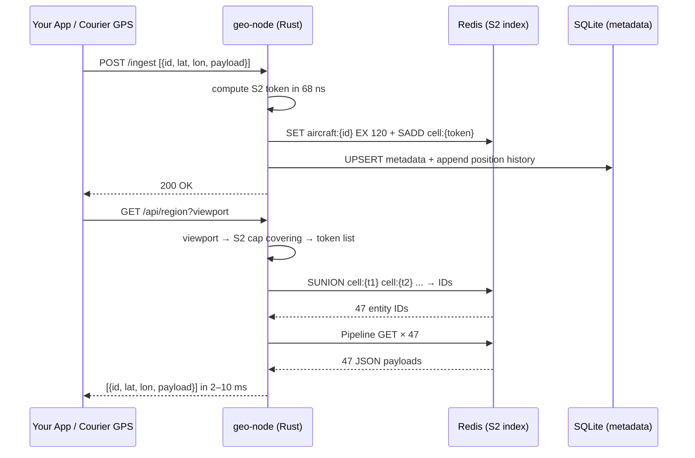
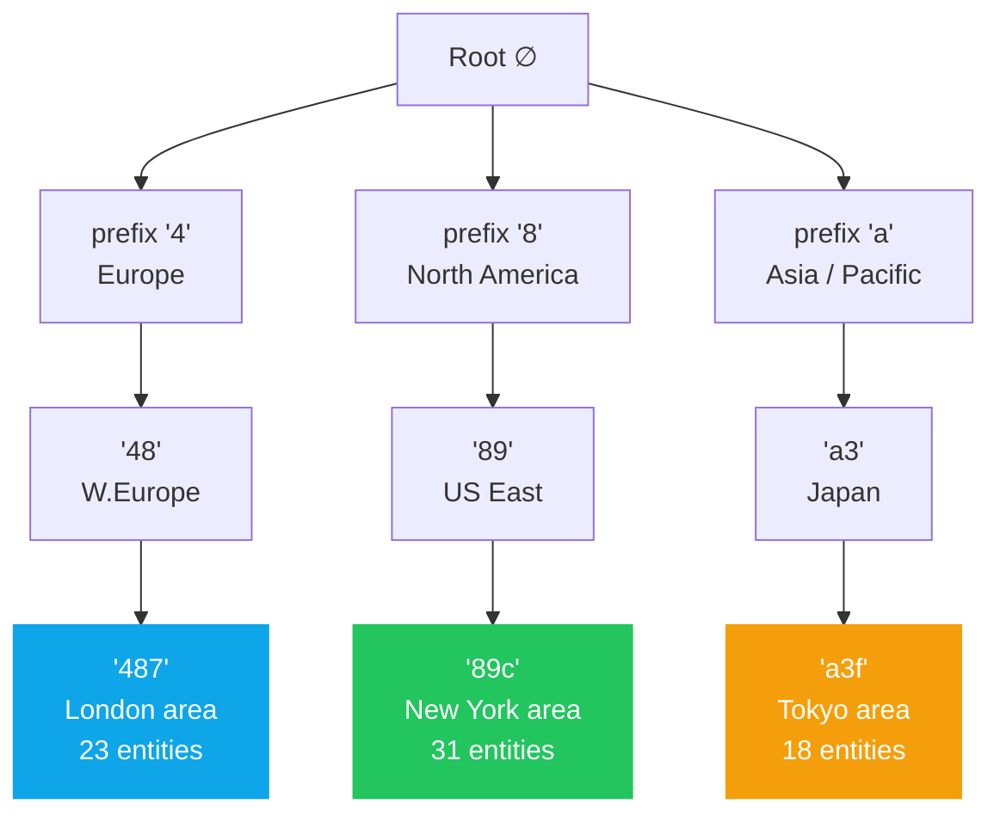
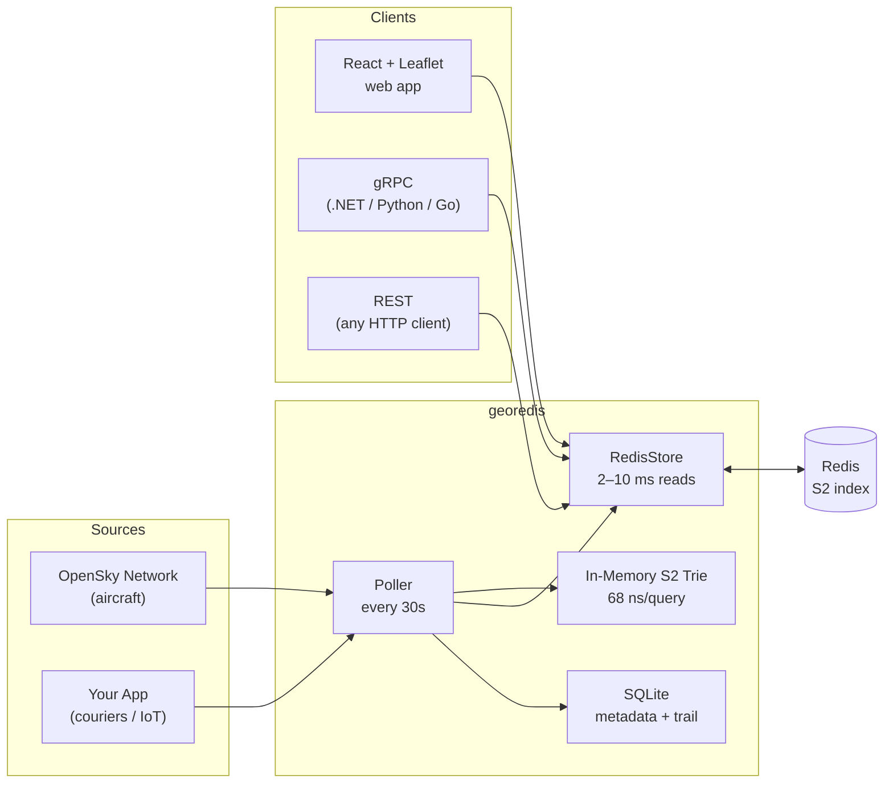
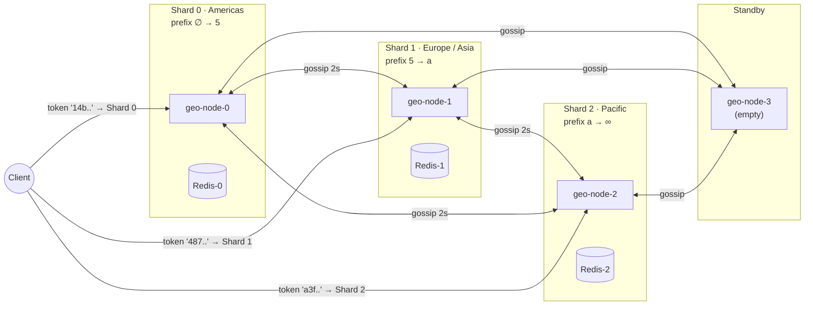

# georedis

**Distributed geospatial trie for real-time dynamic objects, backed by Redis.**

Answers the question *"what is near me right now?"* in 2–10 ms across millions of moving entities — aircraft, couriers, IoT devices, vehicles — without the write-amplification penalty of traditional spatial databases.

[](https://github.com/YOUR_USERNAME/georedis/actions/workflows/ci.yml)
[](https://crates.io/crates/georedis)
[](LICENSE)

---

## What it does



---

## Architecture

### The S2 trie

Each entity is indexed by its [Google S2](https://s2geometry.io/) cell token — a hex string where the prefix encodes geographic hierarchy. The trie organises these tokens so that *all entities near a viewport are reachable by prefix-walking a 5-level tree*, not by scanning a flat list.



A viewport query covering London computes the S2 tokens for that area (`487a`, `487b`, `487c`, ...) and issues a single `SUNION` to Redis — it never touches the New York or Tokyo subtrees.

### Redis data model

```
georedis:aircraft:{id}   →  SET  {json}   EX 120     ← full entity payload
georedis:cell:{token}    →  SADD {id...}  EXPIRE 120  ← spatial index
```

### Data flow



---

## Quick start

### Prerequisites

| Tool | Version |
|---|---|
| [Rust](https://rustup.rs) | stable |
| [Node.js](https://nodejs.org) | ≥ 20 |
| [Docker](https://docker.com) | any recent |

### Single-node demo (aircraft tracker)

```powershell
# Windows
.\scripts\setup.ps1
.\scripts\run-demo.ps1
```

```bash
# Linux / macOS
./scripts/setup.sh && ./scripts/run-demo.sh
```

Open **http://localhost:5173** — 11,000+ live aircraft, rotating plane icons, Redis latency panel.

### Distributed cluster demo (3 shards + gossip + split)

```powershell
# Windows — starts 4 geo-node containers, walks through split + failover
.\scripts\demo-cluster.ps1

# Linux / macOS
./scripts/demo-cluster.sh
```

---

## Configuration

All values are environment variables (copy `config/.env.example` to `.env`):

| Variable | Default | Description |
|---|---|---|
| `REDIS_URL` | `redis://127.0.0.1:6379` | Local or managed Redis. Use `rediss://` for TLS. |
| `SQLITE_PATH` | `georedis.db` | Path for metadata / position-history store |
| `S2_LEVEL` | `9` | Cell granularity — 9≈70km, 12≈2km |
| `POLL_INTERVAL_SECS` | `30` | OpenSky poll cadence |
| `SPLIT_THRESHOLD_KEYS` | `500000` | Auto-split shard when key count exceeds this |
| `SPLIT_THRESHOLD_WRITE_QPS` | `50000` | Auto-split shard when write QPS exceeds this |
| `MERGE_THRESHOLD_KEYS` | `25000` | Auto-merge adjacent shards when both fall below |
| `SUSPECT_SECS` | `10` | Gossip: mark node Suspect after N silent seconds |
| `DEAD_SECS` | `30` | Gossip: mark node Dead after N silent seconds |
| `GOSSIP_INTERVAL_SECS` | `2` | How often each node gossips with peers |

### Cloud Redis

```bash
# Azure Cache for Redis (TLS)
REDIS_URL=rediss://:<access_key>@<name>.redis.cache.windows.net:6380

# AWS ElastiCache
REDIS_URL=rediss://:<auth_token>@<cluster>.cache.amazonaws.com:6380
```

---

## gRPC interface

The canonical cross-platform interface is defined in [`docs/proto/georedis.proto`](docs/proto/georedis.proto). Every `geo-node` exposes both HTTP/REST and gRPC on the same port.

```protobuf
service GeoRedis {
  rpc Insert          (GeoEntry)       returns (InsertResponse);
  rpc InsertBatch     (InsertBatchRequest) returns (InsertResponse);
  rpc QueryRegion     (RegionRequest)  returns (GeoEntriesResponse);
  rpc GetDetail       (DetailRequest)  returns (EntityDetail);
  rpc GetCluster      (Empty)          returns (ClusterResponse);
  rpc TraceCoordinate (TraceRequest)   returns (TraceResponse);
}
```

Client quickstarts:
- [.NET (C#)](docs/quickstart-dotnet.cs)
- [Python](docs/quickstart-python.py)

---

## Distributed cluster

### Geographic shard ring



### Auto-split / roll-up

The split threshold and merge threshold are configurable per cluster (see `demo/k8s/configmap.yaml`). When a shard's key count exceeds `SPLIT_THRESHOLD_KEYS`, it:

1. Scans its Redis for the median occupied S2 prefix (the geographic midpoint)
2. Provisions a standby node
3. Migrates keys ≥ split-point via HTTP batch transfer
4. Updates its own prefix range
5. Gossips the new topology to all peers

No central coordinator. No Zookeeper. Routing table convergence in O(log N) gossip rounds.

### Proving it's distributed

```bash
# London → must be served by the Europe shard
curl "http://localhost:4001/trace?lat=51.5&lon=-0.1"
# → { "owning_node_id": "node-1", "is_local": true, ... }

# New York → must be served by the Americas shard
curl "http://localhost:4000/trace?lat=40.7&lon=-74.0"
# → { "owning_node_id": "node-0", "is_local": true, ... }
```

### Kubernetes deployment (delivery app)

```bash
# Apply all 3 shards + gossip services
kubectl apply -k demo/k8s/

# Check ring convergence
kubectl exec -n georedis deploy/geo-node-0 -- \
  curl -s http://geo-node-0:4000/cluster | jq '.[].node_id'

# Trigger a geographic split
kubectl exec -n georedis deploy/geo-node-1 -- \
  curl -X POST http://geo-node-1:4001/split \
       -d '{"target":"geo-node-3:4003","split_point":"7"}'
```

Each pod runs **Redis as a sidecar container** — loopback latency (<0.1ms) vs cross-pod (~1ms). Replace with `REDIS_URL` pointing to Azure Cache / ElastiCache for managed HA.

---

## Benchmarks

| Operation | Latency | Notes |
|---|---|---|
| Trie insert | **1.04 µs** | In-process, no I/O |
| Trie exact-cell lookup | **68 ns** | O(token_len) ≈ 5 levels |
| Redis write (11k aircraft, real server) | **~170 ms** | Single writer, production |
| Redis read (viewport query, real server) | **2–10 ms** | Low concurrency |
| Redis write (load test, 5k batch) | p50 **900ms** | 4 concurrent writers stress |
| Redis read (load test) | p50 **185ms** | 16 concurrent readers stress |

```bash
# Run trie benchmarks
cargo bench -p georedis

# Single-node load test
cargo run --release -p georedis-loadtest -- --writers 4 --readers 16 --duration-secs 60

# Distributed load test (after docker compose -f demo/cluster-compose.yml up -d)
cargo run --release -p georedis-loadtest -- \
  --shards ':5:redis://localhost:6379,5:a:redis://localhost:6380,a::redis://localhost:6381' \
  --writers 4 --readers 8 --duration-secs 60
```

---

## Why georedis vs alternatives

### tl;dr

Every other option in this space makes a **write-frequency tradeoff** that breaks down for real-time dynamic objects:

```
Traditional spatial DB:  optimised for complex spatial queries on stable data
georedis:               optimised for 10k+ entities updating every 30 seconds
```

### Detailed comparison

| | **georedis** | Redis GEO | PostGIS | Elasticsearch | Tile38 |
|---|---|---|---|---|---|
| **Spatial index** | S2 sphere | Geohash | R-tree | BKD tree | Geohash+R-tree |
| **Write latency** | <1ms | <1ms | 5–50ms | 200–800ms | <1ms |
| **Read latency** | 2–10ms | 10–50ms | 5–30ms | 10–50ms | 5–20ms |
| **Geo edge distortion** | None (S2) | High | None | None | Medium |
| **Hierarchical queries** | ✓ (trie) | ✗ | ✓ (slow) | ✓ (slow) | ✗ |
| **Distributed geo sharding** | ✓ geographic | Hash slot | Manual | Auto (non-geo) | Manual |
| **11k entities @ 30s update** | ~170ms/cycle | ~250ms | 5–30s | not feasible | ~200ms |
| **Position history** | SQLite | ✗ | ✓ | ✓ | ✗ |
| **Language** | Rust | C | C/C++ | Java | Go |
| **Memory / entity** | ~400B | ~60B | ~200B | ~500B | ~200B |

#### vs Redis GEO (GEOADD / GEOSEARCH)

Redis GEO uses a sorted set with geohash-encoded scores. The geohash grid has **~40% boundary distortion** — cells near the poles are much smaller than cells near the equator, and the antimeridian (±180°) creates hard splits. Neighboring cells on the earth's surface can have completely different geohash prefixes, making "nearby" queries require multiple hash prefix lookups.

S2 cells have **equal area** regardless of latitude and **no antimeridian discontinuity** — the Hilbert curve encoding means geographically adjacent cells always share a token prefix.

#### vs PostGIS

PostGIS is the gold standard for analytical queries on *static or slowly-changing* geographic data. For `UPDATE SET lat=$1, lon=$2 WHERE id=$3` happening 11,000 times every 30 seconds, PostgreSQL's MVCC creates 11,000 dead row versions that autovacuum must reclaim. The GiST spatial index needs to rebalance. You can mitigate this with `geom = ST_SetSRID(ST_Point($lon, $lat), 4326)` updates and partial indexes, but you're fighting the engine's design.

georedis replaces each entity atomically via `SET ... EX 120` — Redis's O(1) string operation.

#### vs Elasticsearch geo_point

Elasticsearch's refresh interval means **there is a 200–1000ms lag** between writing a position update and being able to search for it. For a delivery app polling every 5 seconds, this means couriers may be 1–2 polls behind. Elasticsearch also charges full document overhead per entity (~500 bytes) even for a single lat/lon pair.

#### vs Tile38

Tile38 is the closest competitor — a purpose-built real-time geo database. Key differences:

- Tile38 uses a flat R-tree index; georedis uses a **trie over S2 tokens**. The trie enables O(token_len) prefix queries that Tile38 can't do efficiently.
- Tile38 has no distributed sharding story beyond a master-replica setup.
- Tile38 is written in Go; georedis is Rust — **no GC pauses** during heavy write cycles.
- Tile38 has no position history / trail tracking.

---

## Why Rust

1. **No GC pauses** — writing 11,000 aircraft positions every 30 seconds in a GC language (Go, Java, Python) causes stop-the-world events that spike read latency. Rust's ownership system means memory is freed deterministically at zero cost.

2. **68 ns trie lookup** — the S2 trie fits in L2 cache on a modern CPU. In Python, the same lookup would be ~5 µs due to object overhead and interpreter costs. In Rust, it's a few dozen pointer dereferences.

3. **Tokio async** — `geo-node` handles 50k QPS on a single core using non-blocking I/O. The gossip loop, HTTP server, Redis persistence, and metrics collection all run as cooperative tasks on the same thread pool.

4. **Memory efficiency** — `TrieNode` with `HashMap<u8, Box<TrieNode>>` is a cache-friendly structure. The entire global air traffic dataset (11k aircraft) fits in ~2 MB of heap memory.

5. **`cargo` packaging** — single binary deployment. No JVM startup time. No Python virtualenv. The Docker image is 12 MB.

6. **FFI / gRPC** — Rust compiles to `cdylib` or `staticlib` that any language can bind to via FFI. The gRPC interface additionally gives clean cross-language access from .NET, Python, Go, and Java without any native compilation step on the client side.

7. **Fearless concurrency** — the gossip loop, split operation, and HTTP handlers mutate shared state (`ClusterRing`, `GeoTrie`) under `Arc<RwLock<T>>`. The borrow checker ensures no data races at compile time, not at runtime.

---

## API reference

### Single-node (demo/server)

| Endpoint | Description |
|---|---|
| `GET /api/aircraft` | All entities in the in-memory trie |
| `GET /api/region?s=&w=&n=&e=` | Entities in viewport — SUNION + batch GET from Redis |
| `GET /api/aircraft/:id` | Full metadata + position history from SQLite |
| `GET /api/metrics` | Redis read/write latency stats + trie size |
| `GET /api/health` | `{"status":"ok"}` |

### Distributed (geo-node)

| Endpoint | Description |
|---|---|
| `GET /state` | This node's `NodeInfo` |
| `GET /cluster` | Full ring view (all known nodes + prefix ranges) |
| `GET /health` | Health check |
| `GET /metrics` | Key count, memory, status |
| `GET /trace?lat=&lon=` | Prove which shard owns a coordinate |
| `POST /gossip` | Receive a gossip push, return own state |
| `POST /split` | Migrate half the keys to a target node |
| `POST /ingest` | Receive migrated `GeoEntry` batch |
| `PUT /assign-range` | Accept a new prefix range (called by splitting node) |

---

## Repository layout

```
georedis/
├── lib/                   # Core Rust library (publish to crates.io)
│   ├── src/
│   │   ├── trie.rs        # S2-keyed trie — O(token_len) insert + lookup
│   │   ├── store.rs       # Redis persistence — chunked pipelines, SUNION
│   │   ├── metrics.rs     # Lock-free atomic latency counters
│   │   └── cluster.rs     # ClusterRing, NodeInfo — routing data structures
│   ├── tests/             # 22 integration tests
│   └── benches/           # criterion benchmarks
├── demo/
│   ├── server/            # Axum HTTP server + OpenSky poller (single-node demo)
│   ├── geo-node/          # Distributed shard daemon with gossip + split
│   ├── loadtest/          # HDR-histogram load test (single + distributed mode)
│   ├── docker-compose.yml # Single-node: Redis only
│   └── cluster-compose.yml # 3-shard distributed cluster + standby
├── demo/k8s/              # Kubernetes manifests (3 shards, sidecar Redis)
├── docs/
│   ├── proto/georedis.proto # gRPC service definition
│   ├── quickstart-dotnet.cs # C# client example
│   └── quickstart-python.py # Python client example
├── scripts/               # setup, run-demo, demo-cluster (sh + ps1)
└── config/
    └── .env.example       # All configurable variables with defaults
```

---

## License

MIT
