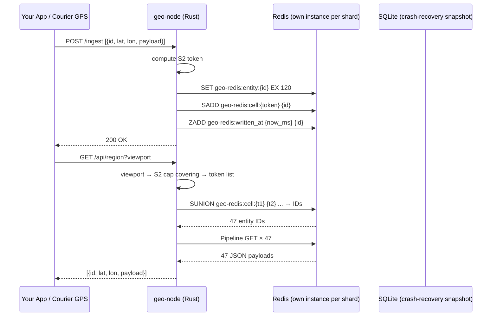
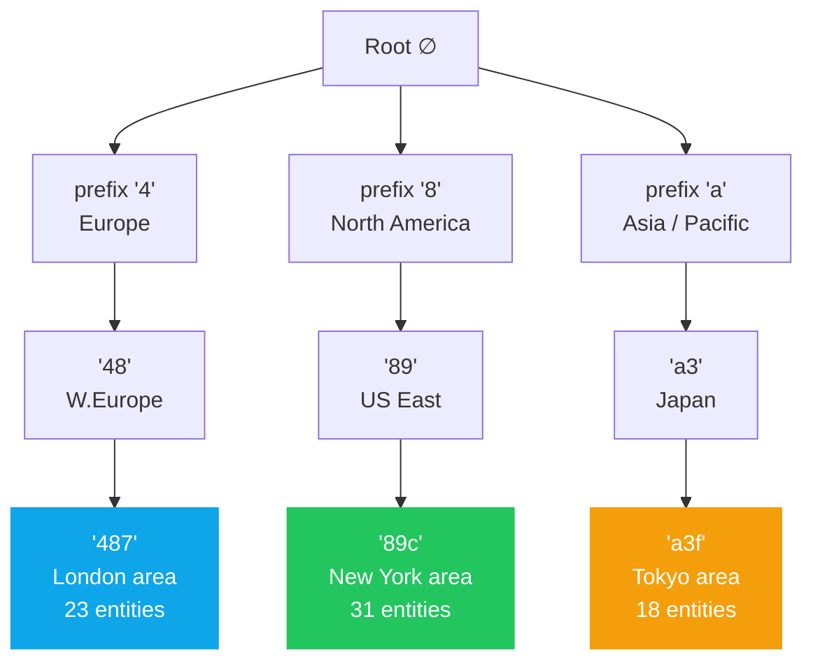
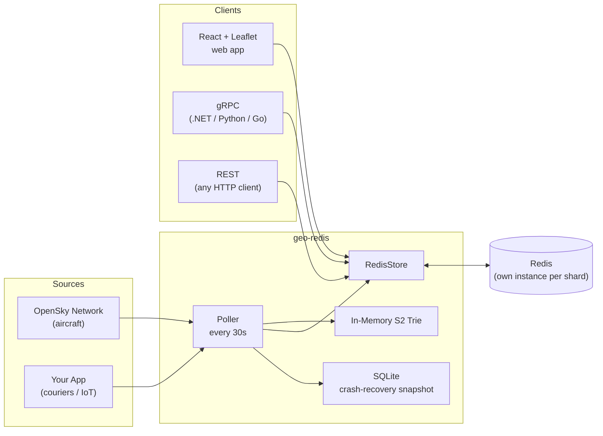
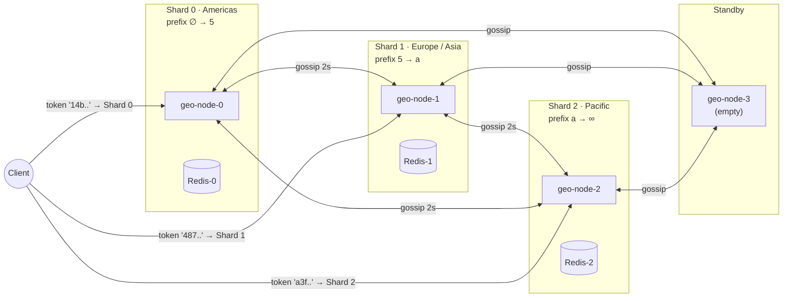

# geo-redis

**A distributed geospatial cache for moving objects — aircraft, couriers, IoT devices, and anything else with a latitude and longitude — backed by Redis.**

The core idea: index every entity by its [Google S2](https://s2geometry.io/) cell token and store those tokens in a trie so that a viewport query walks only the 5–6 relevant prefix branches, not the entire dataset. That makes *read* latency near-constant regardless of how many entities are stored globally.

> **Maturity:** The core library and single-node demo are production-ready. Distributed range changes fail closed unless an etcd v3 metadata authority is configured. etcd transactionally records each range owner through its Raft quorum; Redis is not used for topology authority.

[](https://github.com/dsgouda7/geo-redis/actions/workflows/ci.yml)
[](https://crates.io/crates/geo-redis)
[](LICENSE)

---

## Live demos

Three independent demos ship with the repository, each showing a different angle of the same spatial-index core.

### 📻 Radio Explorer — 30 000 streams indexed locally, play any channel in one click

The most striking demonstration of geo-redis's storage efficiency: **12 500+ geo-tagged live radio streams** from [Radio Browser](https://www.radio-browser.info) are fetched from a public API, inserted into the S2 trie entirely in-memory (no Redis, no database), and served back at any zoom level in under a millisecond.

```
┌─────────────────────────────────────────────────────────────┐
│  Zoom 0–3  →  74 continental bubbles          (S2 level 2) │
│  Zoom 4–5  →  182 country clusters            (S2 level 3) │
│  Zoom 6–7  →  411 regional clusters           (S2 level 4) │
│  Zoom 8+   →  853 city-area leaf cells        (S2 level 5) │
│              ↳ click any leaf → flyout with station list   │
│              ↳ ▶ Play streams directly in the browser      │
└─────────────────────────────────────────────────────────────┘
```

**Why this matters:** 12 500 URLs fit in a hand-full of S2 level-5 cells. The entire spatial index — built from the API response in under 100 ms at startup — lives in ~8 MB of RAM. Queries against it never touch disk or a remote cache. The same trie that routes aircraft queries across three distributed Redis shards here proves it can serve as a zero-dependency in-process spatial store.

```bash
# Start the radio API (no Redis needed)
cargo run -p geo-redis-radio          # → http://localhost:3002

# Start the UI
cd demo/ui && npm run dev:radio     # → http://localhost:5176
```

**Interaction:**
- **Non-leaf marker** — shows only the station count; hover for a tooltip. Clicking has no effect — zoom in first.
- **Leaf marker (zoom ≥ 8)** — glowing indigo border indicates it is interactive. Click to open the station flyout.
- **Flyout** — scrollable list sorted by community votes; search by name, genre, or country; one ▶ / ⏹ per station; playing a new stream auto-stops the previous one.


---

### ✈ Live Aircraft Tracker — 11 000+ aircraft, sub-second regional queries

Polls [OpenSky Network](https://opensky-network.org) every 30 s and stores position updates in a Redis-backed S2 trie. Viewport queries return only the aircraft visible in the current map bounds without scanning the full dataset.

```bash
.\scripts\run-demo.ps1      # Windows
./scripts/run-demo.sh       # Linux / macOS
# → http://localhost:5173
```


---

### 🌦 Live Weather — 5 000 METAR stations, streaming drill-down

Streams live METAR observations from [aviationweather.gov](https://aviationweather.gov) into the trie via SSE. Zoom in past level 10 to switch from S2 aggregate clusters to individual station readings with full weather metadata.

```bash
cargo run -p geo-redis-weather        # → http://localhost:3000 (or $SERVER_PORT)
cd demo/ui && npm run dev:weather   # → http://localhost:5174
```


---

### 🛰 Satellite Tracker — ISS + 200 satellites, day/night terminator

Tracks the ISS and 200 additional satellites via the .NET gRPC backend. Satellites are colour-coded by category (communication, weather, navigation, earth-observation) and overlaid on a real-time day/night terminator line.

```bash
# Start the .NET satellite/earthquake backend
cd demo/earthquake-server && dotnet run   # → http://localhost:3003

# Start the UI
cd demo/ui && npm run dev:earthquake      # → http://localhost:5175/index.earthquake.html
```


---

### 🗺 Distributed Cluster Monitor — key distribution across geo-nodes

Real-time dashboard for the 4-node geo cluster. Shows the S2 token-ring topology, per-shard key counts, split/merge controls, and a live write-rate chart. The key distribution panel below shows how many entities each shard owns — the bars rebalance automatically during a split or merge.

```bash
# Start the 4-node cluster
docker compose -f demo/cluster-compose.yml up -d

# Start the cluster UI
cd demo/cluster-ui && npm run dev          # → http://localhost:5176
```


---

---

## Benchmark Coverage

Measurements are against Redis 7.4.9 in Docker Desktop on Windows 11, loopback
database 15. These are direct library-to-Redis numbers, not HTTP, geo-node,
Kubernetes, or managed-Redis benchmarks. See [TECHNICAL.md §8](TECHNICAL.md)
for full methodology and baseline rationale.

**Baseline:** a naive `HashMap<String, Vec<GeoEntry>>` (in-process) and a flat
`HSET-per-cell` Redis store were measured as the structurally simplest
alternatives. The differences reveal the cost of the richer schema and the
benefit of the prefix structure.

| Workload | Trie | Naive flat | Ratio |
|---|---|---|---|
| `insert_10k` (in-process) | 11.667 ms | 5.654 ms | trie 2.1× slower |
| `query_token` (in-process) | 97.788 ns | 16.343 ns | trie 6× slower |
| `query_prefix_coarse` (in-process) | **35.160 ns** | 13.388 µs | **trie 381× faster** |
| Write 100-entity snapshot (Redis) | 4.11 ms p50 | 1.88 ms p50 | trie 2.2× slower |
| Read, 32-token viewport (Redis) | **1.16 ms p50** | 5.81 ms p50 | **trie 5× faster** |

The trie pays on write and exact single-token lookup. The prefix query and
multi-token viewport reads are where it wins decisively — and those are the
common-case workloads for a moving-object cache at production zoom levels.

---



---

## Architecture

### The S2 trie

Each entity is indexed by its [Google S2](https://s2geometry.io/) cell token — a hex string where the prefix encodes geographic hierarchy. The trie organises these tokens so that *all entities near a viewport are reachable by prefix-walking a 5-level tree*, not by scanning a flat list.



A viewport query covering London computes the S2 tokens for that area (`487a`, `487b`, `487c`, ...) and issues a single `SUNION` to Redis — it never touches the New York or Tokyo subtrees.

### Redis data model

All keys live under a configurable namespace (default `geo-redis`). Each **shard has its own Redis instance** — keys never cross shard boundaries:

```
geo-redis:entity:{id}     →  SET  {json}   EX ttl    ← full entity payload
geo-redis:cell:{token}    →  SADD {id...}  EXPIRE ttl ← spatial index
geo-redis:location:{id}   →  SET  {token}  EX ttl    ← reverse lookup: id → cell token
geo-redis:written_at      →  ZSET score=ms member=id  ← write-timestamp index for delta sync
```

The `written_at` sorted set is the only key without a TTL — it powers `/delta-sync` during shard splits and is pruned periodically by `prune_written_at()`.

### One Redis per shard — always

```
Shard 0 (Americas)          Shard 1 (Europe)            Shard 2 (Pacific)
┌───────────────┐           ┌───────────────┐           ┌───────────────┐
│  geo-node-0   │  ←gossip→ │  geo-node-1   │  ←gossip→ │  geo-node-2   │
│  prefix [∅,5) │           │  prefix [5,a) │           │  prefix [a,∅) │
│  ┌─────────┐  │           │  ┌─────────┐  │           │  ┌─────────┐  │
│  │ redis-0 │  │           │  │ redis-1 │  │           │  │ redis-2 │  │
│  └─────────┘  │           │  └─────────┘  │           │  └─────────┘  │
└───────────────┘           └───────────────┘           └───────────────┘
```

- **Docker** (`demo/cluster-compose.yml`): each geo-node has a dedicated `redis:7-alpine` sidecar container
- **Kubernetes** (`demo/k8s/`): Redis runs as a sidecar in each shard pod
- **Production**: set `REDIS_URL=rediss://...` per shard to a managed instance (Azure Cache for Redis, AWS ElastiCache, Redis Cloud) in the same datacenter region as the geo-node

### Data flow



---

## Quick start

### Prerequisites

| Tool | Version |
|---|---|
| [Rust](https://rustup.rs) | stable |
| [Node.js](https://nodejs.org) | ≥ 24 |
| [Docker](https://docker.com) | any recent (aircraft / cluster demos) |

### Radio Explorer (no Docker, no Redis)

```powershell
# Windows
$env:PATH = "$env:USERPROFILE\.cargo\bin;$env:PATH"
cargo run -p geo-redis-radio                      # API on :3002
# new terminal:
cd demo/ui; npm install; npm run dev:radio      # UI  on :5176
```

Open **http://localhost:5176** — zoom to any city, click a 📻 leaf marker, browse and play local radio stations in the flyout.

### Aircraft tracker (requires Docker for Redis)

```powershell
# Windows
.\scripts\setup.ps1
.\scripts\run-demo.ps1
```

```bash
# Linux / macOS
./scripts/setup.sh && ./scripts/run-demo.sh
```

Open **http://localhost:5173** — 11,000+ live aircraft, rotating plane icons, Redis latency panel.

### Weather stations (requires Docker for Redis)

```powershell
$env:PATH = "$env:USERPROFILE\.cargo\bin;$env:PATH"
cargo run -p geo-redis-weather                    # API on :3000
# new terminal:
cd demo/ui; npm run dev:weather                 # UI  on :5174
```

Open **http://localhost:5174** — global METAR coverage; zoom to a city to switch from S2 cluster aggregates to individual station readings.

### Distributed cluster demo (3 shards + gossip + split)

```powershell
# Windows — starts 4 geo-node containers, walks through split + failover
.\scripts\demo-cluster.ps1

# Linux / macOS
./scripts/demo-cluster.sh
```

---

## Configuration

All values are environment variables (copy `config/.env.example` to `.env`):

| Variable | Default | Description |
|---|---|---|
| `REDIS_URL` | `redis://127.0.0.1:6379` | Local or managed Redis. Use `rediss://` for TLS. |
| `SQLITE_PATH` | `geo-redis.db` | Path for metadata / position-history store |
| `S2_LEVEL` | `9` | Cell granularity — 9≈70km, 12≈2km |
| `POLL_INTERVAL_SECS` | `30` | OpenSky poll cadence |
| `SPLIT_THRESHOLD_KEYS` | `500000` | Recommended operator split threshold; automation is not yet implemented |
| `SPLIT_THRESHOLD_WRITE_QPS` | `50000` | Recommended operator split threshold; automation is not yet implemented |
| `MERGE_THRESHOLD_KEYS` | `25000` | Recommended operator merge threshold; automation is not yet implemented |
| `RADIO_PORT` | `3002` | Port for the radio demo API (`geo-redis-radio`; no Redis dependency) |
| `RADIO_API_BASE` | `https://de1.api.radio-browser.info` | Radio Browser mirror to fetch station data from |
| `RADIO_FETCH_LIMIT` | `50000` | Maximum geo-tagged stations to request from Radio Browser |
| `SUSPECT_SECS` | `10` | Gossip: mark node Suspect after N silent seconds |
| `DEAD_SECS` | `30` | Gossip: mark node Dead after N silent seconds |
| `GOSSIP_INTERVAL_SECS` | `2` | How often each node gossips with peers |

### Cloud Redis

```bash
# Azure Cache for Redis (TLS)
REDIS_URL=rediss://:<access_key>@<name>.redis.cache.windows.net:6380

# AWS ElastiCache
REDIS_URL=rediss://:<auth_token>@<cluster>.cache.amazonaws.com:6380
```

---

## gRPC interface

The canonical cross-platform interface is defined in [`docs/proto/georedis.proto`](docs/proto/georedis.proto). Every `geo-node` exposes HTTP/REST on `HTTP_PORT` and gRPC on `GRPC_PORT` (default: `HTTP_PORT + 10`).

```protobuf
service GeoRedis {
  rpc Insert          (GeoEntry)       returns (InsertResponse);
  rpc InsertBatch     (InsertBatchRequest) returns (InsertResponse);
  rpc QueryRegion     (RegionRequest)  returns (GeoEntriesResponse);
  rpc GetDetail       (DetailRequest)  returns (EntityDetail);
  rpc GetCluster      (Empty)          returns (ClusterResponse);
  rpc TraceCoordinate (TraceRequest)   returns (TraceResponse);
}
```

Client quickstarts:
- [.NET (C#)](docs/quickstart-dotnet.cs)
- [Python](docs/quickstart-python.py)

---

## Distributed cluster

### Geographic shard ring



### Operator-triggered split / roll-up

The split and merge thresholds are configurable per cluster (see `demo/k8s/configmap.yaml`) as operational alerting guidance. A controller does not yet trigger topology changes automatically. When an operator calls authenticated `POST /split` for an overloaded shard, the process:

1. Scans its Redis for the median occupied S2 prefix (the geographic midpoint)
2. Uses a pre-provisioned standby node
3. Migrates keys ≥ split-point via HTTP batch transfer
4. Updates its own prefix range
5. Gossips the new topology to all peers

No central coordinator. No Zookeeper. Routing table convergence in O(log N) gossip rounds.

### Shard split protocol

When an operator calls `POST /split`, it performs a **snapshot-first split**. The source continues serving the old range until the target has completed bootstrap and acknowledged the new range:

```
Source shard                           New shard (Standby → Bootstrapping → Active)
──────────────────────────────────────────────────────────────────────────────────────
POST /split
  ├─ mark Splitting
  ├─ Phase 1: scan entities ≥ split_point (read-only, no mutations)
  │
  ├─ Phase 2 (per chunk):
  │    POST /ingest-snapshot ─────────► 1. append to SQLite snapshot (durable)
  │                                     2. store.merge_entries() → Redis
  │    ◄──── 200 OK (both persisted) ──
  │    delete from source Redis
  │
  ├─ mark Active (new prefix range)
  │
  └─ PUT /assign-range ───────────────► set Bootstrapping
       (source_addr, snapshot_ts)        spawn bootstrap_delta_sync task:
                                           GET /delta-sync?since_ms=T ──────►
Source                                     store.merge_entries(delta)
  ├─ /delta-sync uses                       (freshness check: skip if
  │   entities_written_after()               incoming.written_at ≤ existing)
  └─ returns Vec<GeoEntry> ─────────►    set Active
                                         gossip to all peers
```

**Why snapshot-first matters:** if the new shard crashes mid-migration, it restarts and auto-restores from its SQLite snapshot — no operator intervention, no re-split. The `merge_entries` call is idempotent: re-running it after a crash writes only the entries that are still newer than what Redis holds.

**Why `Bootstrapping` state matters:** a node in `Bootstrapping` refuses all writes with 503. This prevents a split-brain scenario where the new shard accepts writes before it has finished catching up, which would create entities with stale `written_at` that the freshness check would never overwrite.

### Core library API for splits

These are the stable lib-level primitives that the demo `geo-node` builds on:

| Method | Description |
|---|---|
| `RedisStore::merge_entries(entries, s2_level)` | Additive, idempotent upsert with freshness ordering. The canonical primitive for seeding a new shard from a snapshot **and** for delta-sync catch-up. |
| `RedisStore::entities_written_after(since_ms, prefix_start, prefix_end)` | Returns all entities whose `written_at > since_ms` within a prefix range. Powers the `/delta-sync` endpoint. O(log N + result). |
| `GeoTrie::remove_range(start, end)` | Removes all entries whose S2 token falls in `[start, end)`. Called on the source shard after migration to stop holding data it no longer owns. |
| `NodeStatus::Bootstrapping` | Cluster state: node is loading snapshot + performing delta catch-up. Refuses writes until it transitions to `Active`. |

**`GeoEntry.written_at`** (Unix milliseconds, `u64`, `#[serde(default)]`) is set automatically by `persist_trie()` and `merge_entries()` when 0. It flows through snapshot serialisation and delta-sync responses unchanged, so freshness comparisons are meaningful across shard boundaries.

### Proving it's distributed

```bash
# London → must be served by the Europe shard
curl "http://localhost:4001/trace?lat=51.5&lon=-0.1"
# → { "owning_node_id": "node-1", "is_local": true, ... }

# New York → must be served by the Americas shard
curl "http://localhost:4000/trace?lat=40.7&lon=-74.0"
# → { "owning_node_id": "node-0", "is_local": true, ... }
```

### Kubernetes deployment (delivery app)

```bash
# Docker Desktop: enable Kubernetes first, then build the image locally.
docker build -f demo/geo-node/Dockerfile -t geo-redis-geo-node:latest .

# Apply 3 active shards, 1 standby shard, and their gossip services.
kubectl apply -k demo/k8s/
kubectl rollout status -n geo-redis deployment/geo-node-0
kubectl rollout status -n geo-redis deployment/geo-node-1
kubectl rollout status -n geo-redis deployment/geo-node-2
kubectl rollout status -n geo-redis deployment/geo-node-3

# Check ring convergence
kubectl exec -n geo-redis deploy/geo-node-0 -- \
  curl -s http://geo-node-0:4000/cluster | jq '.[].node_id'

# Expose shard 0 locally for manual requests.
kubectl port-forward -n geo-redis service/geo-node-0 4000:4000

# Trigger a geographic split
kubectl exec -n geo-redis deploy/geo-node-1 -- \
  curl -X POST http://geo-node-1:4001/split \
             -H 'Content-Type: application/json' \
       -d '{"target":"geo-node-3:4003","split_point":"7"}'
```

Each pod runs Redis as a sidecar container. Replace it with `REDIS_URL` pointing to Azure Cache / ElastiCache for managed HA.

---

## Benchmarks

See [Benchmark Coverage](#benchmark-coverage) for the current comparative
results including the naive-flat baseline. Run benchmarks with:

```bash
cargo bench -p geo-redis                              # Criterion suite (in-process)
.\scripts\run-experiments.ps1 -Redis 'redis://...'  # Redis experiment suite
```

---

## Why geo-redis vs alternatives

### tl;dr

Every other option in this space makes a write-frequency tradeoff that breaks down for real-time dynamic objects:

```
Traditional spatial DB:  optimised for complex queries on stable data
geo-redis:               optimised for moving entities, backed by Redis,
                         with operator-driven geographic shard changes
```

### Detailed comparison

| | **geo-redis** | Redis GEO | PostGIS | Elasticsearch | Tile38 |
|---|---|---|---|---|---|
| **Published workload benchmark** | Not yet published | Varies by deployment | Varies by deployment | Varies by deployment | Varies by deployment |
| **Geo sharding** | Geographic locality | Hash slot | Manual | Auto (non-geo) | None |
| **Split protocol** | Snapshot + bounded delta-sync | MIGRATE (blocking) | N/A | N/A | N/A |
| **Managed Redis** | ✓ any REDIS_URL | ✓ single-node only | N/A | N/A | N/A |
| **Hierarchical queries** | ✓ (S2 trie) | ✗ | ✓ (slow) | ✓ (slow) | ✗ |
| **Position history** | SQLite | ✗ | ✓ | ✓ | ✗ |

#### vs Redis GEO (GEOADD / GEOSEARCH)

Redis GEO uses a sorted set with geohash-encoded scores. The geohash grid has **~40% boundary distortion** — cells near the poles are much smaller than cells near the equator, and the antimeridian (±180°) creates hard splits. Neighboring cells on the earth's surface can have completely different geohash prefixes, making "nearby" queries require multiple hash prefix lookups.

S2 cells have **equal area** regardless of latitude and **no antimeridian discontinuity** — the Hilbert curve encoding means geographically adjacent cells always share a token prefix.

#### vs PostGIS

PostGIS is the gold standard for analytical queries on *static or slowly-changing* geographic data. For `UPDATE SET lat=$1, lon=$2 WHERE id=$3` happening 11,000 times every 30 seconds, PostgreSQL's MVCC creates 11,000 dead row versions that autovacuum must reclaim. The GiST spatial index needs to rebalance. You can mitigate this with `geom = ST_SetSRID(ST_Point($lon, $lat), 4326)` updates and partial indexes, but you're fighting the engine's design.

geo-redis replaces each entity atomically via `SET ... EX 120` — Redis's O(1) string operation.

#### vs Elasticsearch geo_point

Elasticsearch's refresh interval means **there is a 200–1000ms lag** between writing a position update and being able to search for it. For a delivery app polling every 5 seconds, this means couriers may be 1–2 polls behind. Elasticsearch also charges full document overhead per entity (~500 bytes) even for a single lat/lon pair.

#### vs Tile38

Tile38 is the closest competitor — a purpose-built real-time geo database. Key differences:

- Tile38 uses a flat R-tree; geo-redis uses a **trie over S2 tokens**, enabling O(token_len) prefix queries that Tile38 can't do efficiently.
- Tile38 has no distributed sharding. One server must hold all data for a geographic region with no zero-downtime scale-out path.
- Tile38 is written in Go; geo-redis is Rust — no GC pauses during heavy write cycles.
- Tile38 has no position history.

---

## Why Rust

1. **No GC pauses** — writing 11,000 aircraft positions every 30 seconds in a GC language (Go, Java, Python) causes stop-the-world events that spike read latency. Rust's ownership system means memory is freed deterministically at zero cost.

2. **In-process trie benchmark coverage** — the Criterion suite tracks token lookup and bulk insertion without Redis or HTTP noise. Results are machine-specific and are not published until reproduced with recorded inputs.

3. **Tokio async** — `geo-node` uses non-blocking tasks for gossip, HTTP serving, Redis persistence, and metrics collection. Throughput must be established for the target deployment through load testing.

4. **Memory efficiency** — `TrieNode` stores S2-token branches in a `HashMap<u8, Box<TrieNode>>`; memory use depends on token distribution, payload size, and allocator behavior and should be profiled for the target workload.

5. **`cargo` packaging** — single-binary deployment with no JVM or Python runtime requirement. Image size depends on the target platform and build configuration.

6. **FFI / gRPC** — Rust compiles to `cdylib` or `staticlib` that any language can bind to via FFI. The gRPC interface additionally gives clean cross-language access from .NET, Python, Go, and Java without any native compilation step on the client side.

7. **Fearless concurrency** — the gossip loop, split operation, and HTTP handlers mutate shared state (`ClusterRing`, `GeoTrie`) under `Arc<RwLock<T>>`. The borrow checker ensures no data races at compile time, not at runtime.

---

## API reference

### Single-node (demo/server)

| Endpoint | Description |
|---|---|
| `GET /api/aircraft` | All entities in the in-memory trie |
| `GET /api/region?s=&w=&n=&e=` | Entities in viewport — SUNION + batch GET from Redis |
| `GET /api/aircraft/:id` | Full metadata + position history from SQLite |
| `GET /api/metrics` | Redis read/write latency stats + trie size |
| `GET /api/health` | `{"status":"ok"}` |

### Distributed (geo-node)

| Endpoint | Description |
|---|---|
| `GET /state` | This node's `NodeInfo` |
| `GET /cluster` | Full ring view (all known nodes + prefix ranges) |
| `GET /health` | Health check |
| `GET /metrics` | Key count, memory, status |
| `GET /trace?lat=&lon=` | Prove which shard owns a coordinate |
| `GET /delta-sync?since_ms=T` | Entities written after T ms in this shard's range (for bootstrapping catch-up) |
| `POST /gossip` | Receive a gossip push, return own state |
| `POST /split` | Migrate half the keys to a target node (snapshot-first) |
| `POST /ingest` | Receive a `GeoEntry` batch (range-ownership enforced; 409 if out of range) |
| `POST /ingest-snapshot` | Seed this shard from snapshot entries — writes to SQLite then calls `merge_entries()` |
| `PUT /assign-range` | Accept a new prefix range; transitions to `Bootstrapping` and spawns delta-sync |

---

## Repository layout

```
geo-redis/
├── lib/                   # Core Rust library (publish to crates.io)
│   ├── src/
│   │   ├── trie.rs        # S2-keyed trie — O(token_len) insert + lookup + range-remove
│   │   ├── store.rs       # Redis persistence + GeoStore trait
│   │   ├── metrics.rs     # HDR histogram latency tracking (p50/p95/p99/p99.9)
│   │   └── cluster.rs     # ClusterRing, NodeInfo, NodeStatus (incl. Bootstrapping)
│   ├── tests/             # 22 integration tests
│   └── benches/           # criterion benchmarks
├── demo/
│   ├── server/            # Axum HTTP server + OpenSky poller (single-node demo)
│   ├── weather-server/    # Live METAR weather demo with event-streaming + S2 aggregation
│   ├── geo-node/          # Distributed shard daemon — gossip, snapshot-split, delta-sync
│   ├── loadtest/          # HDR-histogram load test (single + distributed mode)
│   ├── docker-compose.yml # Single-node: Redis only
│   └── cluster-compose.yml # 3-shard distributed cluster + standby
├── demo/k8s/              # Kubernetes manifests (3 shards, sidecar Redis)
├── docs/
│   ├── proto/georedis.proto # gRPC service definition
│   ├── quickstart-dotnet.cs # C# client example
│   └── quickstart-python.py # Python client example
├── scripts/               # setup, run-demo, demo-cluster (sh + ps1)
└── config/
    └── .env.example       # All configurable variables with defaults
```

---

## License

MIT
